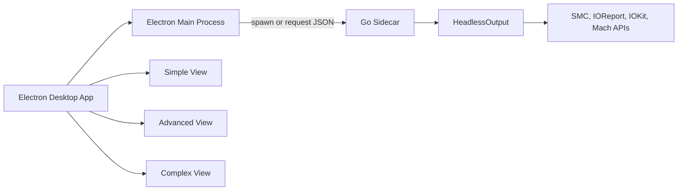

# mactop-desktop

A desktop fork of [mactop](https://github.com/metaspartan/mactop) — an Apple Silicon monitoring tool that exposes real-time CPU, GPU, ANE, DRAM, power, temperature, and system metrics through native macOS APIs.

**mactop-desktop** keeps the same metrics engine as upstream mactop and adds an Electron desktop UI with three planned views: **Simple**, **Advanced**, and **Complex**. It is aimed at developers building macOS apps who need a practical reference for Apple Silicon device information and public APIs.

> **Status:** Early migration. The Go metrics core is unchanged. The legacy terminal UI (TUI) is still present during development and will be removed once the desktop app reliably consumes the same data.

## Architecture



- **Go sidecar** (`internal/app/`): unchanged metrics collection via SMC, IOReport, IOKit, Mach, and CGO.
- **Desktop app** (`desktop/`): Electron shell that will consume `HeadlessOutput` JSON from the Go binary.
- **Headless bridge**: `collectHeadlessData()` in `internal/app/headless.go` is the initial data contract between Go and Electron.

## Compatibility

- Apple Silicon only (ARM64)
- macOS Monterey 12.3+

## Desktop App (Work in Progress)

The Electron app lives in [`desktop/`](desktop/).

### Planned Views

| View | Purpose |
|------|---------|
| **Simple** | At-a-glance CPU, GPU, memory, power, and temperatures |
| **Advanced** | Per-core usage, DRAM bandwidth, fans, network, and process list |
| **Complex** | Full metrics: Thunderbolt tree, RDMA, volumes, sensors, and diagnostics |

### Development

```bash
# Build the Go sidecar
make build

# Install desktop dependencies
cd desktop && npm install

# Run the desktop app (expects ../mactop binary)
npm start
```

The desktop app currently spawns the Go binary in headless mode and polls JSON metrics. UI views are placeholders until the migration matures.

## Legacy Terminal UI (Temporary)

The upstream TUI remains available while the desktop app is being built:

```bash
make build
./mactop
```

TUI removal is a later milestone, after the desktop app renders the same metrics reliably.

## Features

All metrics below come from the unchanged Go core and will be surfaced in the desktop app.

- **No sudo required** — Uses native Apple APIs (SMC, IOReport, IOKit, IOHIDEventSystemClient)
- Apple Silicon monitor written in Go and CGO
- Real-time CPU, GPU, ANE, DRAM, and system power wattage
- GPU frequency and usage percentage
- CPU and GPU temperatures + thermal state
- **M5 Super Core (S-Core) support**: E-cores, P-cores, and S-cores
- **DRAM bandwidth monitoring**: Real-time DRAM read/write bandwidth (GB/s)
- **Comprehensive temperature sensors**: All available SMC temperature sensors with human-readable labels
- **Fan monitoring**: Real-time fan RPM, target speed, mode (Auto/Manual)
- **Fan speed control**: Optional via `--fan-control` flag (writes to SMC)
- Detailed native metrics for CPU cores via Apple's Mach Kernel API
- Memory usage and swap information
- Network usage (upload/download speeds)
- **Thunderbolt bandwidth monitoring**: Real-time throughput for Thunderbolt Bridge interfaces
- **Thunderbolt device tree**: Connected Thunderbolt/USB4 devices and speeds
- **RDMA support**: Detection of RDMA over Thunderbolt 5 availability
- **Battery monitoring**: Percentage and charging state on MacBooks
- Disk I/O activity (read/write speeds)
- Proportional per-process GPU usage (experimental)
- Multiple volume display (Mac HD + mounted external volumes)
- **Headless mode**: JSON metrics to stdout for scripting and desktop bridge (`--headless`)
- **Output formats**: JSON (default), YAML, XML, CSV, and [TOON](https://github.com/toon-format/toon)
- Optional Prometheus metrics server (`-p <port>` or `--prometheus <port>`)
- **macOS menu bar mode**: Native menu bar status item (`--menubar`)
- Support for all Apple Silicon models
- **Configurable units**: Network, disk, and temperature (`--unit-network`, `--unit-disk`, `--unit-temp`)
- **Multi-language support (i18n)**: 20 languages (`--lang` to override)

### Legacy TUI-only features (until desktop parity)

- 20 terminal layouts, themes, party mode, process kill/filter, vim-like navigation
- Overlay HUD (`--overlay`) and fan control hotkeys

## Installation (Go Sidecar)

1. Install [Go](https://go.dev/doc/install).

2. Clone this repository:

   ```bash
   git clone https://github.com/itsryanthedev/mactop-desktop.git
   cd mactop-desktop
   ```

3. Build:

   ```bash
   make build
   ```

4. Run headless (desktop bridge):

   ```bash
   ./mactop --headless --count 1 --pretty
   ```

## Headless Mode (Desktop Data Bridge)

Headless mode is the primary interface for the Electron app during migration:

```bash
# Single sample (scripts, smoke tests)
./mactop --headless --count 1

# Continuous stream with pretty printing
./mactop --headless --pretty

# Other formats
./mactop --headless --format yaml
```

## CLI Flags

- `--headless`: Run without TUI; output metrics to stdout
- `--format`: Headless output format (json, yaml, xml, csv, toon). Default: json
- `--count`: Number of samples in headless mode (0 = infinite)
- `--pretty`: Pretty-print JSON in headless mode
- `--interval` / `-i`: Update interval in milliseconds (default: 1000)
- `--prometheus` / `-p`: Enable Prometheus metrics server on the given port
- `--unit-network`: auto, byte, kb, mb, gb (default: auto)
- `--unit-disk`: auto, byte, kb, mb, gb (default: auto)
- `--unit-temp`: celsius, fahrenheit (default: celsius)
- `--lang`: Language override (e.g. `en`, `es`, `ja`, `zh`)
- `--fan-control`: Interactive fan control (**writes to SMC**; requires `sudo`)
- `--menubar`: macOS menu bar status item
- `--overlay`: Floating overlay HUD (**requires Screen Recording permission**)
- `--dump-fps`, `--dump-temps`, `--dump-debug`: Diagnostics
- `--version` / `-v`, `--help` / `-h`

Legacy TUI flags (`--foreground`, `--bg`, etc.) remain available until TUI removal.

## Permissions

Core metrics do **not** require sudo (CPU, GPU, power, memory, temperatures, fans).

**Screen Recording** is required for FPS/overlay metrics on macOS 15+: enable it for your terminal or Electron app under **System Settings → Privacy & Security → Screen Recording**.

## Roadmap

1. **Now**: README rebrand, `desktop/` scaffold, headless JSON bridge
2. **Next**: Simple view with live metrics from Go sidecar
3. **Then**: Advanced and Complex views
4. **Later**: Remove TUI and terminal-only dependencies (`gotui`)
5. **Future**: Packaged `.app` distribution with embedded Go binary

## Confirmed Apple Silicon Chips

- M1, M1 Pro, M1 Max, M1 Ultra
- M2, M2 Pro, M2 Max, M2 Ultra
- M3, M3 Pro, M3 Max, M3 Ultra
- M4, M4 Pro, M4 Max
- M5, M5 Pro, M5 Max
- A18 Pro

## Contributing

1. Fork **mactop-desktop**
2. Create a feature branch (`git checkout -b feature/your-feature`)
3. Commit your changes
4. Push and open a Pull Request

Run `make test` and `make sexy` before submitting Go changes.

## What APIs Does mactop Use?

- **Apple SMC**: Temperature sensors, system power, fan monitoring and control
- **IOReport API**: CPU, GPU, ANE, and DRAM power (no sudo)
- **IOKit**: GPU frequency from `pmgr`
- **IOHIDEventSystemClient**: Fallback SoC temperature sensors
- **NSProcessInfo.thermalState**: Thermal state (Nominal/Fair/Serious/Critical)
- **Mach Kernel API** (`host_processor_info`): Per-core CPU metrics via CGO

## License

Distributed under the MIT License. See [`LICENSE`](LICENSE).

This project is a derivative work of [mactop](https://github.com/metaspartan/mactop) by Carsen Klock. Original copyright and license notices in source files are preserved.

## Fork Maintainer

Ryan The Dev — [mactop-desktop](https://github.com/itsryanthedev/mactop-desktop)

## Upstream Author

Carsen Klock — [@carsenklock](https://x.com/carsenklock)

Upstream: [https://github.com/metaspartan/mactop](https://github.com/metaspartan/mactop)

## Thanks to Upstream Contributors

mactop-desktop would not exist without [mactop](https://github.com/metaspartan/mactop) and everyone who contributed to it. Thank you to:

- [Carsen Klock](https://github.com/metaspartan) (metaspartan, Meta Spartan)
- [Shahab](https://github.com/tausiq19)
- [ObsidianArch02](https://github.com/ObsidianArch02) / abnormal749 / 陳柏瑋
- [Raghav](https://github.com/raghavawasthi2005)
- [Jon Snow](https://github.com/lifesparts)
- [Michael Freeman](https://github.com/mfreeman451)
- [Oleksandr Redko](https://github.com/oleksandr-redko)
- [Scott Spencer](https://github.com/ssp3nc3r)
- [Aleksandr Izmailov](https://github.com/aizmailov)
- [Anthony Molinaro](https://github.com/anthonymolinaro)
- [ArjunDivecha](https://github.com/ArjunDivecha)
- [Chris Yuan](https://github.com/honglong)
- [Dogan Can](https://github.com/dogancanbaz)
- [Piotr Godlewski](https://github.com/piotrek-godlewski) / Piotrek Rybiec
- [Po-Hsuan Huang](https://github.com/aben20807)
- [Yaroslav](https://github.com/yarkm13)
- [Zhizhen He](https://github.com/hezhizhen)
- [anemll](https://github.com/realanemll)
- [ivanfioravanti](https://github.com/ivanfioravanti)
- [lisiyang](https://github.com/lisiyang)
- [mayor](https://github.com/gavinlinasd)
- [sean10](https://github.com/sean10reborn)
- goreleaserbot (release automation)
- Claude (tooling assistance)

## Acknowledgements

- [mactop](https://github.com/metaspartan/mactop) by Carsen Klock — the foundation of this project
- [gotui](https://github.com/metaspartan/gotui) — terminal UI framework (legacy, pending removal)
- [asitop](https://github.com/tlkh/asitop) — original inspiration
- [htop](https://github.com/htop-dev/htop) — process list and CPU core inspiration

## Disclaimer

This tool is not officially supported by Apple. It is provided as-is. Use at your own risk.
