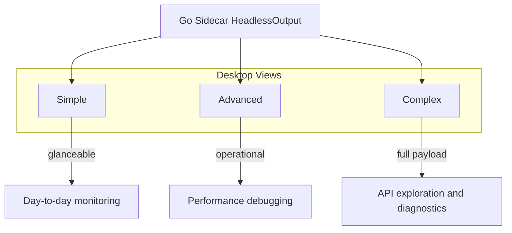
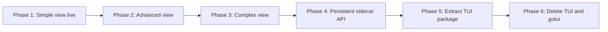

# mactop-desktop Goals

This document defines the product direction for **mactop-desktop**: migrate every user-facing display and interaction from the legacy terminal UI (TUI) into the Electron desktop app, then remove the TUI once parity is proven.

## Mission

Build a desktop app that exposes the same Apple Silicon metrics as [mactop](https://github.com/metaspartan/mactop), but through a native-feeling GUI instead of a terminal. The Go core (`internal/app/`) stays the source of truth for device data; the desktop app is responsible for presentation and interaction.

Target audience: developers building macOS apps who need a practical window into Apple Silicon APIs, power/thermal behavior, and system-level metrics.

## Three Views

The desktop app is organized around three views. Each view is a deliberate trade-off between clarity and depth — not just a resize of the same dashboard.

### Simple

**Who it's for:** Anyone who wants a quick health check without navigating dense panels.

**Goal:** At-a-glance system state in under five seconds.

| Area | What to show |
|------|----------------|
| CPU | Overall usage % |
| GPU | Overall usage % |
| Memory | Used / total |
| Power | Package or total watts |
| Temperature | SoC / CPU temperature |
| Thermal | Nominal, Fair, Serious, Critical |

**UX principles:**
- Large, readable metrics with minimal chrome
- No scrolling required on a standard laptop screen
- Optional sparklines later; not required for v1

**TUI features this replaces (partially):**
- Default compact layouts
- Menu bar collapsed summary (conceptually similar density)

---

### Advanced

**Who it's for:** Developers profiling apps, chasing thermal throttling, or watching sustained load.

**Goal:** Operational detail for day-to-day performance work without dumping raw JSON.

| Area | What to show |
|------|----------------|
| SoC | CPU / GPU / ANE / DRAM power, GPU frequency, cluster activity |
| Cores | Per-core usage (E, P, S on M5+) |
| Memory | Used, available, swap |
| Bandwidth | DRAM read/write GB/s |
| Network & disk | Throughput (in/out, read/write) |
| Processes | Top N by CPU (PID, %, command) |
| Fans | RPM, target, mode |
| Battery | Level and charging state (MacBooks) |

**UX principles:**
- Charts and history for CPU, GPU, memory, and power where useful
- Sortable, filterable process list
- Clear unit labels (W, °C, GiB, GB/s)

**TUI features this replaces:**
- `history_soc` and GPU/memory-focused layouts
- Process list (htop-style)
- Fan & thermals layout (fans + grouped temperatures)
- Power and bandwidth panels
- Network and disk sparklines

---

### Complex

**Who it's for:** Power users, macOS app developers, and anyone mapping Apple Silicon APIs to real data shapes.

**Goal:** Full fidelity — every field from `HeadlessOutput`, plus diagnostics and deep system topology.

| Area | What to show |
|------|----------------|
| Full payload | Raw or structured JSON from the Go sidecar |
| Thunderbolt | Device tree, bus status, per-interface throughput |
| RDMA | Availability and status |
| Volumes | All mounted disks with usage |
| Temperatures | All SMC sensor groups (CPU die, GPU, memory, SSD, airflow, …) |
| Network links | Ethernet and Wi-Fi PHY details |
| Diagnostics | Links to `--dump-temps`, `--dump-debug`, `--dump-fps` workflows |
| Settings | Update interval, units, language |

**UX principles:**
- Tree and table views for hierarchical data (Thunderbolt, sensors)
- Expandable sections instead of one endless scroll
- Copy/export JSON for scripting and bug reports
- API-oriented labels where they help developers (e.g. sensor keys, interface names)

**TUI features this replaces:**
- Info layout (system metadata)
- Thunderbolt / RDMA panels
- All temperature sensor enumeration
- 20-layout cycling (replaced by one purpose-built complex surface)
- Theme and config exploration (moved to settings, not terminal keybindings)

---

## View Comparison

| Capability | Simple | Advanced | Complex |
|------------|:------:|:--------:|:-------:|
| CPU / GPU / memory summary | ✓ | ✓ | ✓ |
| Per-core usage | | ✓ | ✓ |
| Power breakdown | summary | ✓ | ✓ |
| DRAM bandwidth | | ✓ | ✓ |
| Process list | | ✓ | ✓ |
| Fans & temperatures | summary | partial | full |
| Thunderbolt tree | | | ✓ |
| RDMA status | | | ✓ |
| Volumes | | | ✓ |
| Raw `HeadlessOutput` | | | ✓ |
| Diagnostics tools | | | ✓ |

## TUI Removal Strategy

The TUI (`gotui` in `internal/app/`) is **temporary**. It must not be deleted until the desktop app covers the display and interaction surface below.

### Removal criteria (all must be true)

1. **Data parity** — Every metric shown in the TUI is available in at least one desktop view (via `HeadlessOutput` or an equivalent API).
2. **Interaction parity** — User actions that matter for a desktop product are reimplemented:
   - Process list sort, filter, and scroll
   - Configurable update interval and units
   - Settings persistence (`~/.mactop/config.json` or desktop-owned config)
   - Fan control (if kept; requires privileged SMC writes + clear warnings)
3. **Stable bridge** — Electron no longer spawns a new process per poll; use a persistent sidecar or local HTTP/WebSocket API.
4. **Tests green** — `go test ./internal/app/...` passes after TUI code is removed or isolated.
5. **No default TUI path** — `app.Run()` enters desktop/sidecar mode by default, or the binary is split into `mactop-core` + desktop launcher.

### What to remove (after criteria met)

| Layer | Files / dependencies | Notes |
|-------|----------------------|-------|
| TUI runtime | `gotui`, `tcell` imports | Drop from `go.mod` |
| Layout & events | `layout.go`, `events.go`, `events_helpers.go`, `globals.go` | Presentation only |
| Theming | `theme.go`, `colors.go`, `catppuccin.go`, `detection.go` | Replace with desktop CSS/design tokens |
| TUI helpers | `info.go`, TUI portions of `processes.go`, `processes_helpers.go` | Keep `getProcessList` in core |
| Mixed types | `CPUCoreWidget` and other `ui.Block` types in `types.go` | Extract pure domain types first |
| Default `Run()` path | TUI branch in `app.go` | Default becomes headless serve or exit-if-no-flag |

### What to keep

- Native collectors: `ioreport.m`, `smc.c`, `native_stats.go`, `displayfps.m`
- Metrics loop: `metrics.go`, `headless.go`
- Alternate modes until explicitly replaced: `--menubar`, `--overlay`, `--prometheus` (evaluate per feature whether Electron subsumes them)

### Suggested migration order

1. **Simple view** — Prove the headless JSON bridge end-to-end.
2. **Advanced view** — Processes, charts, fans, bandwidth.
3. **Complex view** — Thunderbolt, sensors, full payload, settings.
4. **Sidecar API** — Replace per-poll `spawn` with a long-lived Go process.
5. **Extract TUI** — Move remaining gotui code under `internal/tui/` (optional isolation step).
6. **Delete TUI** — Remove package, dependencies, and TUI-only tests.

### Explicit non-goals for TUI parity

These terminal-only affordances do not need 1:1 recreation unless there is demand:

- **Party mode** — Terminal easter egg; skip in desktop v1.
- **20 layout cycling via `l`** — Replaced by the three fixed views.
- **Vim-style terminal navigation** — Use standard desktop patterns (mouse, scroll, search field).
- **Terminal theme files** — Desktop uses its own design system; migrate color *intent*, not `theme.json` keys literally.

## Success Metrics

- A new contributor can run `make build`, `cd desktop && npm start`, and see live metrics without opening a terminal UI.
- A macOS app developer can open **Complex**, inspect Thunderbolt or sensor data, and understand which APIs back each field.
- The repository builds and tests pass with zero `gotui` imports.
- README and docs describe a desktop-first product, not a terminal monitor.

## Related Docs

- [README](../README.md) — project overview and development setup
- `internal/app/headless.go` — `HeadlessOutput` schema (desktop data contract)
